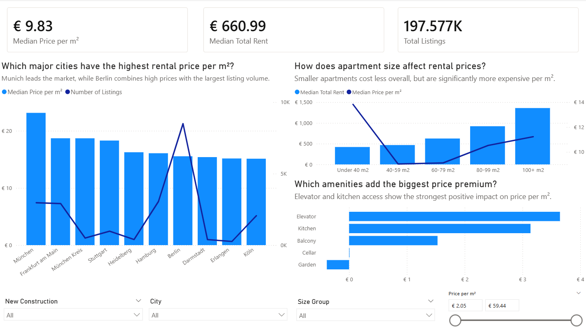
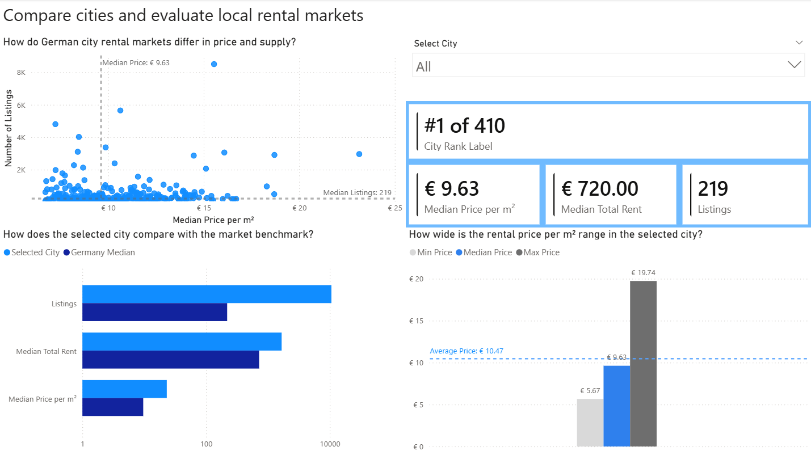
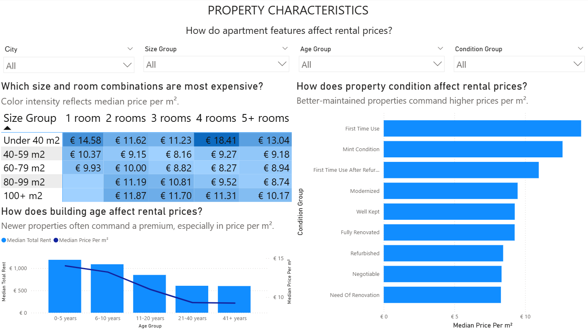
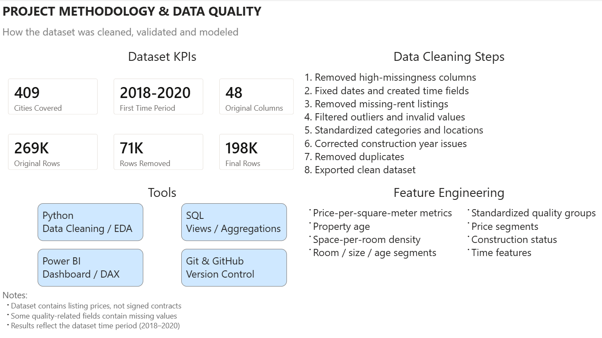

# Germany Rent Analysis

## Project Overview

This project is an end-to-end data analytics case study built around apartment rental listings in Germany. It covers the full workflow from raw data cleaning to exploratory analysis, SQL-based business queries, data validation, and dashboard development.

The goal of the project is not to describe the current German rental market, but to demonstrate a complete analytics process on a real-world, imperfect dataset.

Source dataset: [Apartment rental offers in Germany on Kaggle](https://www.kaggle.com/datasets/corrieaar/apartment-rental-offers-in-germany/data)

## Business Goal

The analysis is designed to answer practical pricing questions such as:

- How strongly do rental prices differ across German cities and states?
- How do apartment size and room count affect total rent and price per m2?
- Do newer or higher-quality properties command a premium?
- Which amenities are associated with higher rental prices?
- Can SQL outputs be trusted by validating them against pandas calculations?

## Dashboard Preview

### Overview
High-level KPIs, pricing benchmarks, and core market patterns.



### City Deep Dive
Compare cities, rankings, and local pricing structure.



### Property Characteristics
How size, age and quality affect rent levels.



### Methodology & Data Quality
How the dataset was cleaned, validated, and transformed into an analytics-ready reporting model.



## Project Stages

The project was completed in five main stages:

1. Data cleaning and feature engineering in Jupyter Notebook
2. Exploratory data analysis to identify pricing patterns and market structure
3. Analytical SQL queries and reusable SQL views in PostgreSQL
4. Validation of SQL results against pandas
5. Dashboard creation in Power BI

## Dataset

- Raw dataset: `data/raw_data.csv`
- Cleaned dataset: `data/rent_cleaned.csv`
- Source size: `268,850` rows and `49` columns
- Final cleaned size: `197,577` rows and `30` columns

Important note: the dataset is historical, so the findings should be interpreted as a portfolio analysis rather than current market intelligence.

## Tools and Technologies

- Python
- pandas
- NumPy
- Jupyter Notebook
- PostgreSQL
- SQL
- SQLAlchemy
- python-dotenv
- Power BI

## Workflow Summary

### 1. Data Cleaning

The cleaning workflow is implemented in `notebooks/data_cleaning.ipynb`.

Main tasks:

- loaded the raw listing data
- removed unneeded columns
- normalized text fields and required values
- created date-based features such as `listing_year` and `listing_month_name`
- engineered analytical metrics including `price_per_m2`, `cold_rent_per_m2`, `property_age`, and `room_density`
- checked duplicates and applied final sanity filters
- exported the cleaned dataset to `data/rent_cleaned.csv`

`property_age` is calculated as:

```
listing_year - year_constructed
```

This makes the feature historically consistent with the listing date instead of the current year.

### 2. Exploratory Data Analysis

The EDA workflow is implemented in `notebooks/EDA.ipynb`.

The notebook explores:

- distribution of rental prices and apartment sizes
- city-level and state-level price differences
- the relationship between living space, total rent, and price per m2
- room-count segments and their pricing behavior
- quality and condition effects
- property age patterns
- numerical correlations between rent-related features
- amenity effects for balcony, lift, kitchen, garden, and cellar

Main analytical takeaway: total rent is driven mainly by apartment size, while price per m2 is shaped more strongly by location, quality, age, and selected amenities.

### 3. SQL Analysis

The SQL layer is stored in the `sql/` folder and is designed for repeatable analysis in PostgreSQL.

Core analytical scripts:

- `location_analysis.sql` for city, state, and district-level price comparisons
- `size_analysis.sql` for room-group and size-group pricing analysis
- `quality_analysis.sql` for construction status, condition, and interior quality comparisons
- `property_age_analysis.sql` for age-group comparisons across the market and major cities
- `amenities_analysis.sql` for amenity price-gap analysis
- `ranking_and_benchmark_analysis.sql` for ranking, benchmarking, and window-function-based comparisons
- `data_quality_checks.sql` for completeness and numeric range checks

Reusable views are created in `sql/views.sql`, including:

- `vw_rentals_enriched`
- `vw_city_price_summary`
- `vw_rooms_group_summary`
- `vw_size_group_summary`
- `vw_amenities_summary`
- `vw_property_age_summary`

### 4. Data Validation

The validation workflow is implemented in `notebooks/validation.ipynb`.

It checks consistency between:

- the cleaned CSV and the PostgreSQL table `rentals_cleaned`
- SQL quality checks and equivalent pandas calculations
- SQL views and equivalent pandas aggregations

During validation, negative `property_age` values were detected.  
The root cause was the original age calculation logic.

The feature was then redesigned in the cleaning pipeline.

Small differences around median calculations can still appear at the `0.01` level because PostgreSQL uses `PERCENTILE_CONT`, while pandas uses `median()`.

### 5. Dashboard

The final dashboard file is stored in:

```text
dashboard/german_rent.pbix
```

The dashboard is built on top of the cleaned dataset and SQL-ready analytical structure, allowing the project to move from notebook exploration into a business-style reporting layer.

## Repository Structure

```text
germany_rent_analysis/
|-- dashboard/
|   `-- german_rent.pbix
|-- data/
|   |-- raw_data.csv
|   `-- rent_cleaned.csv
|-- images/
|   |-- overview.png
|   |-- city_deep_dive.png
|   |-- property_characteristics.png
|   `-- methodology.png
|-- notebooks/
|   |-- data_cleaning.ipynb
|   |-- EDA.ipynb
|   `-- validation.ipynb
|-- sql/
|   |-- amenities_analysis.sql
|   |-- data_quality_checks.sql
|   |-- fix_negative_property_age.sql
|   |-- location_analysis.sql
|   |-- property_age_analysis.sql
|   |-- quality_analysis.sql
|   |-- ranking_and_benchmark_analysis.sql
|   |-- schema_fix.sql
|   |-- size_analysis.sql
|   `-- views.sql
|-- src/
|   `-- csv_to_postgres.py
|-- .env.example
`-- README.md
```

## Reproducibility

### 1. Create and activate a virtual environment

```powershell
python -m venv .venv
.venv\Scripts\Activate.ps1
```

### 2. Install dependencies

```powershell
pip install pandas numpy jupyter python-dotenv sqlalchemy psycopg2-binary
```

### 3. Configure PostgreSQL connection

Create a local `.env` file based on `.env.example`:

```env
DB_USER=postgres
DB_PASSWORD=your_password_here
DB_HOST=localhost
DB_PORT=5432
DB_NAME=your_database_name
```

### 4. Run the project

Recommended order:

1. Run `notebooks/data_cleaning.ipynb`
2. Run `notebooks/EDA.ipynb`
3. Load the cleaned data into PostgreSQL with `src/csv_to_postgres.py`
4. Execute `sql/schema_fix.sql` if type alignment is needed
5. Execute `sql/views.sql`
6. Run analytical SQL scripts from the `sql/` folder
7. Run `notebooks/validation.ipynb`
8. Open the Power BI dashboard in `dashboard/german_rent.pbix`

To load the cleaned CSV into PostgreSQL:

```powershell
python src/csv_to_postgres.py
```

## Key Insights

## Key Insights

- Rental prices vary substantially across Germany. The overall median price is **€9.83/m²**, while **Munich** reaches **€23.14/m²** — around **135% higher** than the dataset median.
- The overall median total rent is **€660.99**, compared with **€1.67k** in Munich — approximately **153% higher**.
- Apartment size strongly affects unit pricing. Listings under **40 m²** have the highest median price (**€13.83/m²**), while mid-sized apartments (**40–79 m²**) are notably cheaper at around **€9/m²**.
- Larger apartments become more expensive again on a per-square-meter basis: **80–99 m² = €10.53/m²**, **100+ m² = €11.23/m²**.
- Small apartments, especially one-room units, form a premium segment with elevated price per m².
- Amenities show different pricing effects. A **lift** or **kitchen** is associated with a premium of **€3+/m²**, while a **balcony** adds around **€1.53/m²**.
- Some amenities have little or no pricing effect: **cellar ≈ €0**, while **garden** is associated with a slight discount (**-€0.38/m²**).
- Better condition, stronger interior quality, and new-build status are generally associated with higher prices.
- Validation is an essential part of analytics work when combining notebooks, SQL logic, and reporting layers.

## Limitations

- The dataset is historical and should not be used for current market conclusions
- The project is descriptive and analytical, not predictive
- Some attributes contain missing values that limit certain segment comparisons
- Some cities show unexpectedly large listing counts compared with their population size, so volume-based comparisons should be interpreted cautiously.
- Some rare room-size combinations contain very few listings and should be interpreted cautiously.
- SQL and pandas median logic may produce very small rounding differences

## What This Project Demonstrates

- data cleaning on a messy real-world dataset
- feature engineering for analytics-ready modeling
- EDA in Jupyter Notebook
- SQL analysis in PostgreSQL
- analytical view design for reporting
- validation of SQL logic against pandas
- dashboard delivery in Power BI

## Possible Future Improvements

- package the workflow with a requirements file
- automate more of the SQL execution flow
